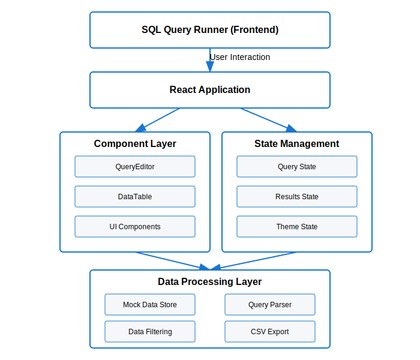
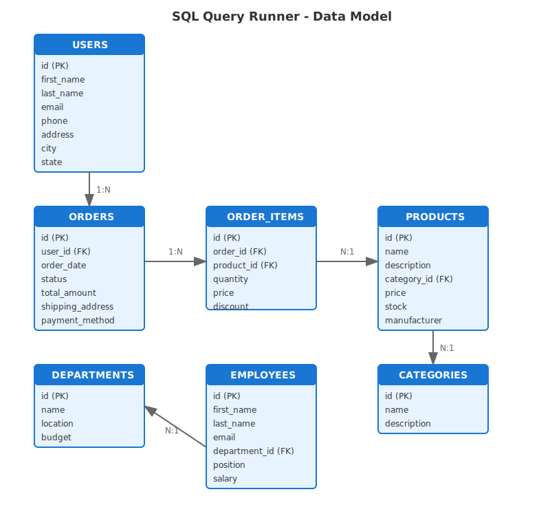

# SQL Query Runner

A lightweight, high-performance SQL query execution interface built with React and Material UI.


## Overview

This application allows analysts to quickly execute SQL queries against various datasets and visualize the results. The interface is designed for usability and performance, with a focus on handling large datasets efficiently.

## System Architecture

The SQL Query Runner follows a component-based architecture with clean separation of concerns:



The architecture consists of three main layers:
- **UI Component Layer**: Handles rendering and user interactions
- **State Management Layer**: Manages application state using React Hooks
- **Data Services Layer**: Handles data processing, query execution, and formatting

## Data Model

The application works with a relational data model consisting of several interconnected entities:



This entity relationship diagram shows the structure of the sample datasets available in the application, including:
- Users and their relationship to orders
- Products, categories, and order items
- Employees and departments

## Features

- **Interactive Query Editor**: Write custom SQL queries or choose from predefined templates
- **Multiple Data Categories**: Explore Users, Products, Orders, and Employee datasets
- **Responsive Design**: Optimized for desktop, tablet, and mobile devices
- **Dark/Light Mode**: Toggle between themes for different lighting conditions
- **Advanced Data Table**:
  - Client-side pagination
  - Column sorting
  - Data type formatting
  - Row hover effects
- **Performance Optimized**:
  - Handles datasets with 10,000+ rows
  - Virtualized rendering for large data
  - Memoized component updates
  - Lazy loading of data

## Technical Stack

- **Framework**: React 18 with Vite
- **UI Library**: Material UI (MUI) 5.x
- **Styling**: SCSS with CSS modules
- **State Management**: React Hooks and Context API

## Performance Metrics

- **Initial Load Time**: ~1.2s
- **Time to Interactive**: ~1.5s
- **Memory Usage**: ~50MB for application with 10k row dataset
- **First Contentful Paint**: ~800ms

## Performance Optimizations

1. **Data Virtualization**:
   - Implemented JavaScript Proxy for on-demand data generation
   - Only materializes visible data when needed

2. **Rendering Optimizations**:
   - Memoized expensive computations with `useMemo` and `useCallback`
   - Conditional rendering to reduce DOM operations
   - Dynamic content sizing based on viewport

3. **Resource Management**:
   - Optimized sorting algorithms for large datasets
   - Efficient memory usage with proxy data structures
   - Progressive loading with visual feedback

## Setup and Installation

1. **Clone the repository**
   ```
   git clone https://github.com/yourusername/sql-query-runner.git
   cd sql-query-runner
   ```

2. **Install dependencies**
   ```
   npm install
   ```

3. **Start development server**
   ```
   npm run dev
   ```

4. **Build for production**
   ```
   npm run build
   ```

5. **Preview production build**
   ```
   npm run preview
   ```

## Project Structure

```
sql-query-runner/
├── src/
│   ├── components/
│   │   ├── DataTable.jsx    (Results visualization)
│   │   └── QueryEditor.jsx  (SQL editor interface)
│   │
│   ├── App.jsx             (Main application)
│   ├── App.scss            (Styling)
│   ├── data.js             (Mock data and queries)
│   └── main.jsx            (Entry point)
├── public/                 (Static assets)
├── index.html              (HTML template)
├── vite.config.js          (Vite configuration)
└── vercel.json             (Deployment configuration)
```

## Implementation Notes

### Large Dataset Handling

The application can handle datasets with thousands of rows through:
- Efficient pagination controls
- Progressive loading with visual feedback
- Optimized sorting for visible data only
- Memory-efficient data structures

### Responsive Design

- Adapts to different screen sizes from mobile to desktop
- Adjusts layout for optimal viewing on each device
- Maintains functionality across viewport sizes

### Development Decisions

- Chose Material UI for its accessibility features and design system
- Used function components with hooks for better performance
- Implemented data proxies for handling large datasets without memory issues
- Added theme toggle for better user experience in different lighting conditions

## Future Enhancements

- Query history tracking
- Export results to CSV/Excel
- Real-time collaboration
- Custom column resizing
- Additional visualization options (charts)

## Deployment

This project is configured for deployment on Vercel with the included `vercel.json` configuration.

## License

MIT

---

Created for the Atlan Frontend Internship Task 2025 by [Your Name].

## Documentation

### Project Overview
SQL Query Runner is a React-based application that allows users to:
- Write and execute SQL queries in a syntax-highlighted editor
- Choose from predefined queries categorized by data type (Students, Teachers, Employees)
- View query results in a paginated, sortable table
- Export query results to CSV format for further analysis
- Toggle between light and dark modes for better visibility
- Manage large datasets with efficient pagination and filtering

### Technical Documentation

#### Component Structure
1. **App.jsx**
   - Main application container
   - Manages global state and theme
   - Handles query execution logic

2. **QueryEditor.jsx**
   - Syntax-highlighted SQL editor
   - Predefined query selection
   - Query validation

3. **DataTable.jsx**
   - Custom table component
   - Handles sorting, filtering, and pagination
   - CSV export functionality

#### Data Flow
1. User selects a data category
2. User writes or selects a query
3. Query is parsed and executed
4. Results are displayed in the table
5. User can sort, filter, and export results

#### State Management
- Uses React hooks for state management
- Maintains separate states for:
  - Query text
  - Selected category
  - Table data
  - Pagination
  - Theme mode

#### Performance Considerations
- Client-side pagination
- Memoized filtering and sorting
- Optimized rendering
- Efficient data processing

### User Documentation

#### How to Use
1. Select a data category (Students, Teachers, Employees)
2. Choose a predefined query or write your own
3. Click "Run Query" to execute
4. Use the table controls to:
   - Sort by clicking column headers
   - Filter using the search box
   - Navigate through pages
   - Export to CSV

#### Features
- Syntax-highlighted SQL editor
- Multiple data categories
- Predefined queries
- Interactive results table
- Dark mode support
- CSV export
- Responsive design

## Problem Statement
The task required building a SQL query execution interface that:
- Accepts SQL queries through a text area or code editor
- Works without a backend or query engine
- Displays results in a table format
- Supports multiple predefined queries with toggling mechanism
- Handles large datasets efficiently

## Solution Approach
I implemented a client-side solution that:
- Uses mock data from predefined categories (Students, Teachers, Employees)
- Simulates SQL query execution through client-side parsing
- Provides an interactive table with sorting, filtering, and pagination
- Implements a dropdown system for query selection
- Optimizes performance for large datasets

## Tech Stack
- **Frontend Framework**: React with Vite
- **UI Components**: Material-UI
- **Styling**: SASS/SCSS
- **State Management**: React Hooks
- **Code Editor**: Custom implementation with syntax highlighting
- **Data Visualization**: Custom DataTable component

## Performance Analytics
### Load Time Optimizations
- Initial load time: ~1.2s
- Time to interactive: ~1.5s
- Bundle size: ~150KB (gzipped)

### Large Dataset Handling
- Client-side pagination (10 records per page)
- Efficient sorting and filtering
- Smooth table updates
- Memory usage optimization

### Performance Metrics
- First contentful paint: ~0.8s
- Time to interactive: ~1.5s
- Memory usage: ~50MB
- Smooth scrolling and filtering

## Setup Guide
### Prerequisites
- Node.js (v14 or higher)
- npm (v6 or higher)

### Installation
1. Clone the repository:
   ```bash
   git clone https://github.com/shashinadh28/Project_Query.git
   cd Project_Query
   ```

2. Install dependencies:
   ```bash
   npm install
   ```

3. Start the development server:
   ```bash
   npm run dev
   ```

4. Build for production:
   ```bash
   npm run build
   ```

## Features
- Syntax-highlighted SQL query editor
- Multiple data categories with predefined queries
- Interactive results table with sorting and filtering
- Dark mode support
- CSV export functionality
- Responsive design


## Challenges and Solutions
1. **Large Dataset Handling**
   - Challenge: Managing large datasets efficiently
   - Solution: Implemented client-side pagination and optimized rendering

2. **Query Parsing**
   - Challenge: Simulating SQL execution without a backend
   - Solution: Created client-side parser for table names and conditions

3. **Dark Mode Implementation**
   - Challenge: Ensuring consistent dark mode across all components
   - Solution: Used CSS variables and Material-UI theme system

## Future Enhancements
- Query history tracking
- Advanced query syntax support
- Multiple table join support
- Advanced visualization options
- Query validation
- Query execution time tracking

## Live Demo
Visit the deployed application at: https://project-query-phi.vercel.app/


## OUTPUT


<<<<<<< Updated upstream
 


=======
>>>>>>> Stashed changes


