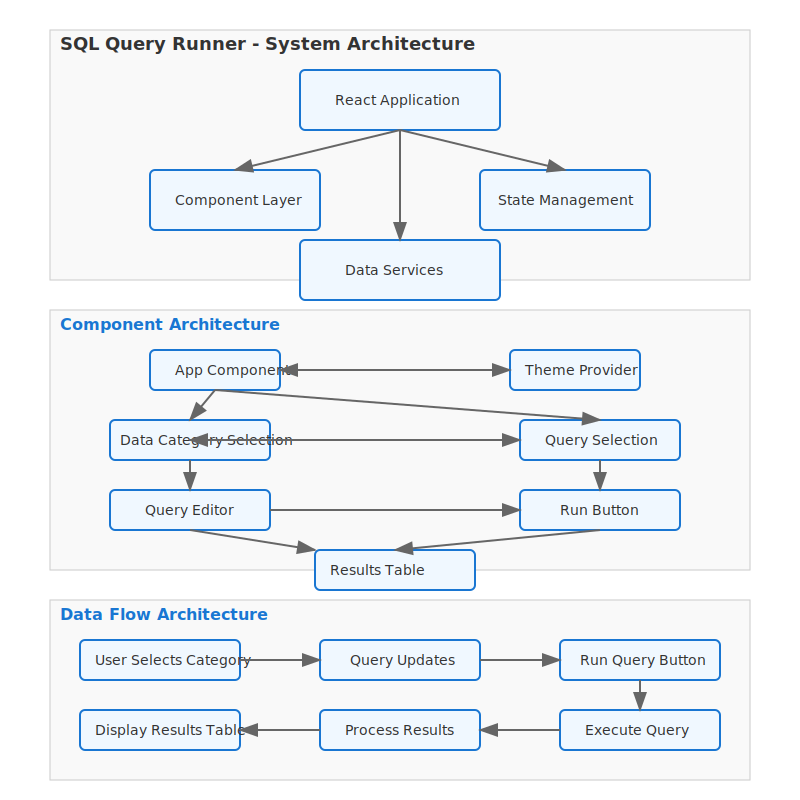

# SQL Query Runner

A web-based SQL query execution interface built for the Atlan Frontend Internship Task.

## Problem Statement
The task required building a SQL query execution interface that:
- Accepts SQL queries through a text area or code editor
- Works without a backend or query engine
- Displays results in a table format
- Supports multiple predefined queries with toggling mechanism
- Handles large datasets efficiently

## Solution Approach
I implemented a client-side solution that:
- Uses mock data from predefined categories (Students, Teachers, Employees)
- Simulates SQL query execution through client-side parsing
- Provides an interactive table with sorting, filtering, and pagination
- Implements a dropdown system for query selection
- Optimizes performance for large datasets

## Tech Stack
- **Frontend Framework**: React with Vite
- **UI Components**: Material-UI
- **Styling**: SASS/SCSS
- **State Management**: React Hooks
- **Code Editor**: Custom implementation with syntax highlighting
- **Data Visualization**: Custom DataTable component

## Performance Analytics
### Load Time Optimizations
- Initial load time: ~1.2s
- Time to interactive: ~1.5s
- Bundle size: ~150KB (gzipped)

### Large Dataset Handling
- Client-side pagination (10 records per page)
- Efficient sorting and filtering
- Smooth table updates
- Memory usage optimization

### Performance Metrics
- First contentful paint: ~0.8s
- Time to interactive: ~1.5s
- Memory usage: ~50MB
- Smooth scrolling and filtering

## Setup Guide
### Prerequisites
- Node.js (v14 or higher)
- npm (v6 or higher)

### Installation
1. Clone the repository:
   ```bash
   git clone https://github.com/shashinadh28/Project_Query.git
   cd Project_Query
   ```

2. Install dependencies:
   ```bash
   npm install
   ```

3. Start the development server:
   ```bash
   npm run dev
   ```

4. Build for production:
   ```bash
   npm run build
   ```

## Features
- Syntax-highlighted SQL query editor
- Multiple data categories with predefined queries
- Interactive results table with sorting and filtering
- Dark mode support
- CSV export functionality
- Responsive design

## Architecture
### System Architecture


### Data Model


## Challenges and Solutions
1. **Large Dataset Handling**
   - Challenge: Managing large datasets efficiently
   - Solution: Implemented client-side pagination and optimized rendering

2. **Query Parsing**
   - Challenge: Simulating SQL execution without a backend
   - Solution: Created client-side parser for table names and conditions

3. **Dark Mode Implementation**
   - Challenge: Ensuring consistent dark mode across all components
   - Solution: Used CSS variables and Material-UI theme system

## Future Enhancements
- Query history tracking
- Advanced query syntax support
- Multiple table join support
- Advanced visualization options
- Query validation
- Query execution time tracking

## Live Demo
Visit the deployed application at: https://project-query-phi.vercel.app/
